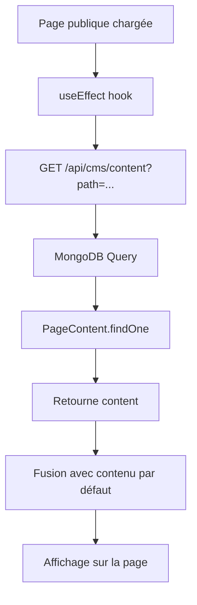

# 🏗️ ARCHITECTURE ET FONCTIONNEMENT DU CMS - AZALÉE PATRIMOINE

## 📋 Vue d'ensemble

Le système CMS (Content Management System) d'Azalée Patrimoine est un système de gestion de contenu **headless** qui permet de modifier le contenu de toutes les pages du site **sans redémarrage du serveur**. Il utilise une architecture **modulaire et réutilisable** basée sur Next.js 14, MongoDB et React.

---

## 🏗️ ARCHITECTURE GLOBALE

### **1. Structure des Composants**

```
📁 CMS System Architecture
├── 🎨 Interface CMS Admin (/admin/cms)
│   ├── Page de gestion globale
│   ├── Liste des pages
│   └── Édition de pages individuelles
│
├── 🧩 Composant Générique CMS
│   └── GenericCMSPage.jsx (Réutilisable pour toutes les pages)
│
├── 🌐 Pages Publiques (/)
│   ├── /fiscalite/*
│   ├── /placements
│   ├── /immobilier
│   └── ... (toutes les pages du site)
│
├── 🔌 API Layer (Next.js API Routes)
│   ├── /api/cms/content (GET - Récupération)
│   ├── /api/cms/pages (CRUD complet)
│   └── /api/auth/* (Authentification)
│
└── 🗄️ Base de Données (MongoDB)
    ├── Collection: pagecontents
    └── Collection: users
```

---

## 🗄️ MODÈLE DE DONNÉES

### **Collection `pagecontents` (MongoDB)**

Le modèle `PageContent` stocke le contenu de chaque page :

```javascript
{
  path: String,           // Chemin unique de la page (ex: "fiscalite/lois-fiscales")
  title: String,          // Titre de la page
  content: Mixed,         // Contenu structuré (JSON flexible)
  published: Boolean,     // Statut de publication
  lastModified: Date,     // Date de dernière modification
  modifiedBy: String,     // Utilisateur qui a modifié
  createdAt: Date,        // Date de création (auto)
  updatedAt: Date          // Date de mise à jour (auto)
}
```

**Schéma Mongoose** (`src/lib/models/PageContent.js`) :
- `path` : Unique, lowercase, trim
- `content` : Type `Mixed` (peut stocker n'importe quelle structure JSON)
- Index sur `path` (unique) et `published`

---

## 🔄 FLUX DE DONNÉES

### **1. Processus de Sauvegarde (CMS → Base de Données)**

```mermaid
graph TD
    A[Utilisateur modifie contenu] --> B[GenericCMSPage.jsx]
    B --> C[handleSave()]
    C --> D[POST /api/cms/content]
    D --> E[Validation des données]
    E --> F[PageContent.findOneAndUpdate]
    F --> G[MongoDB - Collection pagecontents]
    G --> H[Contenu sauvegardé]
    H --> I[Event: contentUpdated]
    I --> J[Rechargement automatique]
```

**Étapes détaillées :**

1. **Modification dans l'interface CMS**
   - L'utilisateur clique sur "Modifier" pour une section
   - Le formulaire s'affiche avec les données actuelles (CMS ou par défaut)
   - L'utilisateur modifie les champs

2. **Sauvegarde**
   ```javascript
   // GenericCMSPage.jsx - handleSave()
   const response = await fetch('/api/cms/content', {
     method: 'POST',
     body: JSON.stringify({
       page: pageSlug,        // Ex: "fiscalite/lois-fiscales"
       section: editingSection, // Ex: "hero"
       data: formData          // { title: "...", description: "..." }
     })
   });
   ```

3. **Traitement API** (à implémenter dans `/api/cms/content`)
   - Récupère ou crée le document `PageContent` pour le `path`
   - Met à jour le `content[section]` avec les nouvelles données
   - Sauvegarde dans MongoDB

4. **Mise à jour automatique**
   - Déclenchement d'un événement `contentUpdated`
   - Rechargement du contenu depuis la base
   - Notification de succès à l'utilisateur

### **2. Processus de Chargement (Base de Données → Page Publique)**



**Étapes détaillées :**

1. **Chargement de la page**
   ```javascript
   // Page publique (ex: src/app/fiscalite/lois-fiscales/page.jsx)
   useEffect(() => {
     fetch('/api/cms/content?path=fiscalite/lois-fiscales')
       .then(res => res.json())
       .then(data => setContent(data.data));
   }, []);
   ```

2. **Récupération depuis MongoDB**
   ```javascript
   // /api/cms/content - GET
   const page = await PageContent.findOne({ 
     path: path.toLowerCase(),
     published: true 
   });
   return page.content; // Structure JSON flexible
   ```

3. **Fusion avec contenu par défaut**
   - Si le contenu CMS existe → utilise le contenu CMS
   - Sinon → utilise le contenu par défaut défini dans le code
   - Permet un fallback gracieux

---

## 🧩 COMPOSANT GÉNÉRIQUE CMS

### **GenericCMSPage.jsx**

Composant réutilisable pour toutes les pages CMS.

**Props :**
```javascript
{
  pageSlug: String,        // Identifiant unique de la page
  pageTitle: String,       // Titre affiché dans l'interface
  sections: Array,         // Configuration des sections
  defaultContent: Object    // Contenu par défaut par section
}
```

**Configuration d'une section :**
```javascript
{
  id: 'hero',                    // Identifiant unique
  name: 'Section Hero',           // Nom affiché
  description: 'Titre principal', // Description
  fields: [                       // Champs éditables
    {
      key: 'title',
      label: 'Titre Principal',
      type: 'text',              // text, textarea, select, json, image, color
      required: true,
      help: 'Texte d\'aide optionnel'
    }
  ],
  templates: [                    // Templates rapides (optionnel)
    {
      name: 'Template 1',
      data: { title: '...', description: '...' }
    }
  ]
}
```

**Types de champs supportés :**
- `text` : Champ texte simple
- `textarea` : Zone de texte multiligne
- `select` : Liste déroulante avec options
- `json` : Éditeur JSON avec validation
- `image` : URL d'image avec prévisualisation
- `color` : Sélecteur de couleur

**Fonctionnalités :**
- ✅ Édition en temps réel
- ✅ Prévisualisation avant sauvegarde
- ✅ Recherche de sections
- ✅ Indicateurs de statut (modifié, par défaut, vide)
- ✅ Templates rapides
- ✅ Réinitialisation aux valeurs par défaut
- ✅ Notifications de succès/erreur

---

## 🔌 API ENDPOINTS

### **1. GET /api/cms/content**

Récupère le contenu d'une page spécifique.

**Query Parameters :**
- `path` (required) : Chemin de la page

**Réponse :**
```json
{
  "success": true,
  "data": {
    "hero": { "title": "...", "description": "..." },
    "section1": { ... }
  }
}
```

**Code actuel :** ✅ Implémenté

---

### **2. POST /api/cms/content**

Sauvegarde le contenu d'une section pour une page.

**Body :**
```json
{
  "page": "fiscalite/lois-fiscales",
  "section": "hero",
  "data": {
    "title": "Nouveau titre",
    "description": "Nouvelle description"
  }
}
```

**Réponse :**
```json
{
  "success": true,
  "message": "Content saved successfully"
}
```

**Code actuel :** ❌ **À IMPLÉMENTER** (le composant l'appelle mais l'endpoint n'existe pas)

**Implémentation nécessaire :**
```javascript
// src/app/api/cms/content/route.js
export async function POST(request) {
  try {
    await connectDB();
    const { page, section, data } = await request.json();
    
    // Récupère ou crée la page
    let pageContent = await PageContent.findOne({ path: page.toLowerCase() });
    
    if (!pageContent) {
      // Crée une nouvelle page
      pageContent = new PageContent({
        path: page.toLowerCase(),
        title: page, // ou extraire du path
        content: {},
        published: true
      });
    }
    
    // Met à jour la section spécifique
    pageContent.content = {
      ...pageContent.content,
      [section]: data
    };
    
    pageContent.lastModified = new Date();
    await pageContent.save();
    
    return NextResponse.json({
      success: true,
      message: 'Content saved successfully'
    });
  } catch (error) {
    return NextResponse.json(
      { success: false, message: error.message },
      { status: 500 }
    );
  }
}
```

---

### **3. GET /api/cms/pages**

Récupère toutes les pages ou une page spécifique.

**Query Parameters :**
- `path` (optional) : Pour récupérer une page spécifique

**Réponse (liste) :**
```json
{
  "success": true,
  "data": [
    { "path": "fiscalite/lois-fiscales", "title": "...", ... }
  ],
  "count": 10
}
```

**Code actuel :** ✅ Implémenté

---

### **4. POST /api/cms/pages**

Crée une nouvelle page.

**Body :**
```json
{
  "path": "nouvelle-page",
  "title": "Nouvelle Page",
  "content": {},
  "published": true
}
```

**Code actuel :** ✅ Implémenté

---

### **5. PUT /api/cms/pages**

Met à jour une page existante.

**Body :**
```json
{
  "path": "fiscalite/lois-fiscales",
  "title": "Nouveau titre",
  "content": { ... },
  "published": true
}
```

**Code actuel :** ✅ Implémenté

---

### **6. DELETE /api/cms/pages**

Supprime une page.

**Query Parameters :**
- `path` (required) : Chemin de la page à supprimer

**Code actuel :** ✅ Implémenté

---

## 📝 EXEMPLE D'UTILISATION

### **1. Créer une page CMS**

```javascript
// src/app/fiscalite/lois-fiscales/page.jsx
import GenericCMSPage from '@/components/cms/GenericCMSPage';

const sections = [
  {
    id: 'hero',
    name: 'Section Hero',
    description: 'Titre principal et introduction',
    fields: [
      { key: 'title', label: 'Titre', type: 'text', required: true },
      { key: 'subtitle', label: 'Sous-titre', type: 'text' },
      { key: 'description', label: 'Description', type: 'textarea' }
    ]
  },
  {
    id: 'content',
    name: 'Contenu Principal',
    description: 'Contenu détaillé de la page',
    fields: [
      { key: 'text', label: 'Texte', type: 'textarea', rows: 10 }
    ]
  }
];

const defaultContent = {
  hero: {
    title: 'Lois Fiscales',
    subtitle: 'Comprendre les lois fiscales',
    description: 'Description par défaut...'
  },
  content: {
    text: 'Contenu par défaut...'
  }
};

export default function LoisFiscalesPage() {
  return (
    <GenericCMSPage
      pageSlug="fiscalite/lois-fiscales"
      pageTitle="Lois Fiscales"
      sections={sections}
      defaultContent={defaultContent}
    />
  );
}
```

### **2. Utiliser le contenu CMS dans une page publique**

```javascript
// src/app/fiscalite/lois-fiscales/page.jsx
'use client';
import { useEffect, useState } from 'react';

export default function LoisFiscalesPage() {
  const [content, setContent] = useState(null);
  const [loading, setLoading] = useState(true);

  useEffect(() => {
    fetch('/api/cms/content?path=fiscalite/lois-fiscales')
      .then(res => res.json())
      .then(data => {
        if (data.success) {
          setContent(data.data);
        }
      })
      .finally(() => setLoading(false));
  }, []);

  if (loading) return <div>Chargement...</div>;
  if (!content) return <div>Contenu non trouvé</div>;

  return (
    <div>
      <h1>{content.hero?.title || 'Lois Fiscales'}</h1>
      <p>{content.hero?.description || 'Description par défaut'}</p>
      <div>{content.content?.text || 'Contenu par défaut'}</div>
    </div>
  );
}
```

---

## 🔐 SÉCURITÉ ET AUTHENTIFICATION

### **Authentification requise**

Toutes les routes CMS nécessitent une authentification :

1. **Middleware d'authentification** (à implémenter)
   - Vérifie le token JWT dans les headers
   - Redirige vers `/admin/login` si non authentifié

2. **Rôles utilisateurs**
   - `admin` : Accès complet (CRUD)
   - `editor` : Modification uniquement
   - `viewer` : Lecture uniquement

3. **Protection des API**
   ```javascript
   // Exemple de middleware
   export async function middleware(request) {
     const token = request.headers.get('Authorization');
     if (!token) {
       return NextResponse.redirect('/admin/login');
     }
     // Vérifier le token JWT
   }
   ```

---

## 🚀 AMÉLIORATIONS FUTURES

### **1. Fonctionnalités manquantes**

- [ ] **POST /api/cms/content** : Endpoint de sauvegarde de sections
- [ ] **Middleware d'authentification** : Protection des routes CMS
- [ ] **Gestion des médias** : Upload d'images directement dans le CMS
- [ ] **Versioning** : Historique des modifications
- [ ] **Prévisualisation en temps réel** : Voir les changements avant publication
- [ ] **Traduction** : Support multilingue
- [ ] **Cache** : Mise en cache du contenu pour améliorer les performances

### **2. Optimisations**

- [ ] **Cache Redis** : Cache des pages fréquemment consultées
- [ ] **CDN** : Distribution du contenu statique
- [ ] **Lazy loading** : Chargement différé des sections
- [ ] **Compression** : Compression des réponses API

---

## 📊 DIAGRAMME D'ARCHITECTURE COMPLET

```
┌─────────────────────────────────────────────────────────────┐
│                    CLIENT (Browser)                          │
│  ┌──────────────┐  ┌──────────────┐  ┌──────────────┐     │
│  │ Admin CMS UI  │  │ Public Pages │  │ GenericCMS   │     │
│  └──────┬────────┘  └──────┬───────┘  └──────┬───────┘     │
└────────┼─────────────────────┼──────────────────┼────────────┘
         │                     │                  │
         │ HTTP Requests       │                  │
         ▼                     ▼                  ▼
┌─────────────────────────────────────────────────────────────┐
│              NEXT.JS API ROUTES (Server)                    │
│  ┌──────────────┐  ┌──────────────┐  ┌──────────────┐     │
│  │ /api/cms/    │  │ /api/cms/    │  │ /api/auth/   │     │
│  │ content      │  │ pages        │  │ verify       │     │
│  └──────┬────────┘  └──────┬───────┘  └──────┬───────┘     │
└────────┼─────────────────────┼──────────────────┼────────────┘
         │                     │                  │
         │ Mongoose Queries    │                  │
         ▼                     ▼                  ▼
┌─────────────────────────────────────────────────────────────┐
│                    MONGODB DATABASE                         │
│  ┌──────────────┐  ┌──────────────┐                       │
│  │ pagecontents │  │ users        │                       │
│  │ Collection    │  │ Collection   │                       │
│  └──────────────┘  └──────────────┘                       │
└─────────────────────────────────────────────────────────────┘
```

---

## 📚 RÉFÉRENCES

- **Modèle de données** : `src/lib/models/PageContent.js`
- **Composant CMS** : `src/components/cms/GenericCMSPage.jsx`
- **API Routes** : `src/app/api/cms/`
- **Interface Admin** : `src/app/admin/cms/page.jsx`

---

## ✅ CHECKLIST D'IMPLÉMENTATION

Pour compléter le système CMS :

- [x] Modèle PageContent créé
- [x] API GET /api/cms/content implémentée
- [x] API CRUD /api/cms/pages implémentée
- [x] Composant GenericCMSPage créé
- [x] Interface admin CMS créée
- [ ] **POST /api/cms/content à implémenter** ⚠️
- [ ] Middleware d'authentification à ajouter
- [ ] Tests unitaires à écrire
- [ ] Documentation utilisateur à créer

---

**Dernière mise à jour :** 2024
**Version :** 1.0.0

