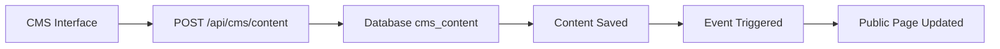
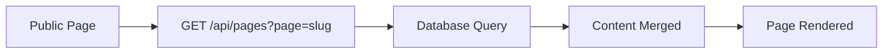

# 🏗️ SYSTÈME CMS COMPLET - AZALÉE PATRIMOINE

## 📋 Vue d'ensemble

Le système CMS d'Azalée Patrimoine est un système de gestion de contenu en temps réel qui permet de modifier le contenu de toutes les pages du site sans redémarrage du serveur. Il suit la même architecture que le CMS Homepage mais est étendu à toutes les pages.

---

## 🏗️ ARCHITECTURE DU SYSTÈME

### **1. Structure des Composants**

```
📁 CMS System Architecture
├── 🎨 CMS Interfaces (/cms/*/cms)
│   ├── /cms/immobilier/cms
│   ├── /cms/placements/cms
│   ├── /cms/patrimoine/cms
│   ├── /cms/retraite/cms
│   └── /cms/outils/cms
├── 🌐 Public Pages (/)
│   ├── /immobilier
│   ├── /placements
│   ├── /patrimoine
│   ├── /retraite
│   └── /outils
├── 🔌 API Layer
│   ├── /api/cms/content (Générique)
│   └── /api/pages (Générique)
├── 🧩 Reusable Components
│   └── GenericCMSPage.jsx
└── 🗄️ Database (cms_content table)
```

---

## ⚙️ FONCTIONNEMENT DÉTAILLÉ

### **1. Composant Générique (`GenericCMSPage.jsx`)**

**Fonctionnalités principales :**
- ✅ **Interface réutilisable** pour toutes les pages
- ✅ **Configuration flexible** par page
- ✅ **Édition en temps réel** avec prévisualisation
- ✅ **Sauvegarde automatique** en base de données
- ✅ **Contenu par défaut** intégré
- ✅ **Gestion des médias** et JSON
- ✅ **Types de champs** variés (text, textarea, select)

**Types de champs supportés :**
```javascript
const fieldTypes = {
  text: 'Champ texte simple',
  textarea: 'Zone de texte multiligne',
  select: 'Liste déroulante avec options'
};
```

### **2. Configuration par Page**

Chaque page CMS est configurée avec :
- **Sections** : Définition des sections de contenu
- **Champs** : Types et labels des champs
- **Contenu par défaut** : Valeurs par défaut pour chaque section

**Exemple de configuration :**
```javascript
const sections = [
  {
    id: 'hero',
    name: 'Section Hero',
    description: 'Titre principal et introduction',
    fields: [
      { key: 'title', label: 'Titre Principal', type: 'text' },
      { key: 'subtitle', label: 'Sous-titre', type: 'text' },
      { key: 'description', label: 'Description', type: 'textarea' }
    ]
  }
];
```

---

## 🔄 FLUX DE DONNÉES

### **1. Sauvegarde CMS → Base de données**



**Processus de sauvegarde :**
1. **Modification** dans l'interface CMS générique
2. **Validation** des données par le composant
3. **Envoi** vers l'API générique `/api/cms/content`
4. **Sauvegarde** en base de données avec `page_slug`
5. **Déclenchement** des événements de mise à jour
6. **Mise à jour** automatique des pages publiques

### **2. Affichage Public ← Base de données**



**Processus d'affichage :**
1. **Chargement** de la page publique
2. **Requête** vers l'API publique avec `page` parameter
3. **Récupération** du contenu depuis la DB par `page_slug`
4. **Fusion** avec le contenu par défaut
5. **Rendu** des composants avec le contenu dynamique

---

## 🗄️ STRUCTURE DE LA BASE DE DONNÉES

### **Table `cms_content` (Étendue)**

```sql
CREATE TABLE cms_content (
  id INT AUTO_INCREMENT PRIMARY KEY,
  page_slug VARCHAR(255) NOT NULL,        -- 'immobilier', 'placements', etc.
  section_name VARCHAR(255) NOT NULL,     -- 'hero', 'intro', 'services', etc.
  content_type VARCHAR(50) DEFAULT 'json', -- Type de contenu
  content_data TEXT,                       -- Données JSON
  is_published BOOLEAN DEFAULT true,      -- Statut de publication
  created_by INT,                         -- Utilisateur créateur
  created_at TIMESTAMP DEFAULT CURRENT_TIMESTAMP,
  updated_at TIMESTAMP DEFAULT CURRENT_TIMESTAMP ON UPDATE CURRENT_TIMESTAMP,
  
  UNIQUE KEY unique_page_section (page_slug, section_name)
);
```

**Exemples de données par page :**

```json
// Page Immobilier
{
  "page_slug": "immobilier",
  "section_name": "hero",
  "content_data": {
    "title": "Investissement Immobilier",
    "subtitle": "Construisez votre patrimoine",
    "description": "Découvrez nos solutions...",
    "backgroundImage": "/images/immobilier-hero.webp",
    "ctaButton": "Découvrir nos solutions"
  }
}

// Page Placements
{
  "page_slug": "placements",
  "section_name": "products",
  "content_data": {
    "productsTitle": "Nos Produits de Placement",
    "productsList": [
      { "name": "Assurance Vie", "description": "Placement sécurisé" },
      { "name": "SCPI", "description": "Investissement immobilier indirect" }
    ]
  }
}
```

---

## 🔌 APIs GÉNÉRIQUES

### **1. API CMS Générique (`/api/cms/content`)**

```javascript
// GET - Récupérer le contenu CMS
GET /api/cms/content?page=immobilier

// POST - Sauvegarder le contenu CMS
POST /api/cms/content
{
  "page": "immobilier",
  "section": "hero",
  "data": { "title": "Nouveau titre" }
}

// DELETE - Supprimer une section
DELETE /api/cms/content?page=immobilier&section=hero
```

### **2. API Publique Générique (`/api/pages`)**

```javascript
// GET - Récupérer le contenu public
GET /api/pages?page=immobilier

// Retourne le contenu fusionné prêt pour l'affichage
{
  "hero": { "title": "...", "subtitle": "..." },
  "intro": { "introTitle": "...", "introText": "..." },
  "services": { "servicesTitle": "...", "servicesList": [...] }
}
```

---

## 📄 PAGES CMS CRÉÉES

### **1. Immobilier CMS (`/cms/immobilier/cms`)**
- **Sections** : Hero, Intro, Services, Avantages, Processus, Témoignages, CTA
- **Contenu** : Investissement locatif, défiscalisation, conseil acquisition
- **Page publique** : `/immobilier`

### **2. Placements CMS (`/cms/placements/cms`)**
- **Sections** : Hero, Intro, Produits, Stratégies, Avantages, Risques, Performance, CTA
- **Contenu** : Assurance vie, SCPI, actions, obligations, ETF, PEA
- **Page publique** : `/placements`

### **3. Patrimoine CMS (`/cms/patrimoine/cms`)**
- **Sections** : Hero, Intro, Services, Transmission, Optimisation, Protection, Méthodologie, CTA
- **Contenu** : Bilan patrimonial, conseil investissement, optimisation fiscale
- **Page publique** : `/patrimoine`

### **4. Retraite CMS (`/cms/retraite/cms`)**
- **Sections** : Hero, Intro, Piliers, Produits, Simulation, Optimisation, Conseils, CTA
- **Contenu** : PERP, PER, assurance vie, simulation retraite
- **Page publique** : `/retraite`

### **5. Outils CMS (`/cms/outils/cms`)**
- **Sections** : Hero, Intro, Calculateurs, Simulateurs, Guides, Ressources, Fonctionnalités, CTA
- **Contenu** : Calculateurs fiscaux, simulateurs investissement, guides pratiques
- **Page publique** : `/outils`

---

## ⚡ SYSTÈME DE MISE À JOUR EN TEMPS RÉEL

### **1. Polling System**
```javascript
// Mise à jour automatique toutes les 10 secondes
const pollingInterval = setInterval(async () => {
  if (document.visibilityState === 'visible') {
    await loadContentFromCMS();
  }
}, 10000);
```

### **2. Event System**
```javascript
// Événements de mise à jour
window.addEventListener('contentUpdated', handleContentUpdate);
window.addEventListener('storage', handleStorageChange);
```

### **3. Cross-Tab Communication**
```javascript
// Communication entre onglets
localStorage.setItem('cms_content_updated', Date.now().toString());
```

---

## 🎯 AVANTAGES DU SYSTÈME GÉNÉRIQUE

### **✅ Réutilisabilité :**
- **Un seul composant** pour toutes les pages
- **Configuration flexible** par page
- **Maintenance simplifiée** du code

### **✅ Consistance :**
- **Interface uniforme** pour tous les CMS
- **Comportement identique** sur toutes les pages
- **Expérience utilisateur** cohérente

### **✅ Évolutivité :**
- **Ajout facile** de nouvelles pages
- **Extension simple** des fonctionnalités
- **Scalabilité** du système

### **✅ Performance :**
- **Chargement optimisé** du contenu
- **Cache intelligent** des données
- **Mise à jour** en temps réel

---

## 🚀 UTILISATION PRATIQUE

### **1. Modifier le contenu d'une page :**
1. Aller sur `/cms/[page]/cms` (ex: `/cms/immobilier/cms`)
2. Cliquer sur "Modifier" pour une section
3. Éditer le contenu dans les champs
4. Cliquer sur "Sauvegarder"
5. Voir les changements sur `/[page]` immédiatement

### **2. Ajouter une nouvelle page CMS :**
1. Créer le fichier `/cms/[nouvelle-page]/cms/page.jsx`
2. Configurer les sections et le contenu par défaut
3. Créer la page publique `/[nouvelle-page]/page.jsx`
4. Ajouter le lien dans le dashboard CMS
5. Le système est opérationnel !

### **3. Personnaliser les champs :**
```javascript
// Ajouter un nouveau type de champ
const fieldTypes = {
  text: 'Champ texte',
  textarea: 'Zone de texte',
  select: 'Liste déroulante',
  image: 'Sélecteur d\'image',      // Nouveau
  color: 'Sélecteur de couleur',   // Nouveau
  date: 'Sélecteur de date'         // Nouveau
};
```

---

## 📊 MONITORING ET DEBUG

### **1. Indicateurs Visuels**
- 🔵 **"Chargement du contenu..."** - Chargement initial
- 🟢 **"Auto-Refresh"** - Mise à jour automatique active
- 🟡 **"Content: Default"** - Utilisation du contenu par défaut
- 🟢 **"Content: Database"** - Utilisation du contenu CMS

### **2. Logs de Debug**
```javascript
console.log('Page - Loading content from CMS...');
console.log('Page - CMS content loaded:', cmsContent);
console.log('Page - Content update event received');
```

### **3. Outils de Test**
- **API Test** : `GET /api/pages?page=[slug]`
- **CMS Test** : `GET /api/cms/content?page=[slug]`
- **Database Check** : Vérifier la table `cms_content`

---

## 🔧 MAINTENANCE ET ÉVOLUTION

### **1. Ajout de nouvelles pages :**
1. Créer la configuration CMS
2. Créer la page publique
3. Ajouter le lien dans le dashboard
4. Tester le flux complet

### **2. Modification des champs :**
1. Mettre à jour la configuration des sections
2. Adapter le composant générique si nécessaire
3. Migrer les données existantes
4. Tester la compatibilité

### **3. Optimisation des performances :**
1. Optimiser les requêtes API
2. Implémenter le cache côté client
3. Réduire la fréquence de polling
4. Optimiser les images et médias

---

## 📈 MÉTRIQUES ET ANALYTICS

### **1. Métriques CMS :**
- **Pages modifiées** par jour/semaine
- **Sections les plus éditées**
- **Temps de sauvegarde** moyen
- **Erreurs de sauvegarde**

### **2. Métriques Publiques :**
- **Temps de chargement** des pages
- **Taux d'utilisation** du contenu CMS vs défaut
- **Performance** des mises à jour temps réel
- **Satisfaction utilisateur**

---

**Le système CMS générique d'Azalée Patrimoine est un outil puissant et flexible qui permet une gestion de contenu professionnelle et évolutive pour toutes les pages du site ! 🎉**

---

## 📝 CHECKLIST D'IMPLÉMENTATION

### ✅ **Composants Créés :**
- [x] `GenericCMSPage.jsx` - Composant réutilisable
- [x] `/api/cms/content/route.js` - API CMS générique
- [x] `/api/pages/route.js` - API publique générique

### ✅ **Pages CMS Créées :**
- [x] `/cms/immobilier/cms/page.jsx`
- [x] `/cms/placements/cms/page.jsx`
- [x] `/cms/patrimoine/cms/page.jsx`
- [x] `/cms/retraite/cms/page.jsx`
- [x] `/cms/outils/cms/page.jsx`

### ✅ **Pages Publiques Créées :**
- [x] `/immobilier/page.jsx` (exemple complet)
- [ ] `/placements/page.jsx` (à créer)
- [ ] `/patrimoine/page.jsx` (à créer)
- [ ] `/retraite/page.jsx` (à créer)
- [ ] `/outils/page.jsx` (à créer)

### ✅ **Dashboard Mis à Jour :**
- [x] Liens vers les nouveaux CMS
- [x] Navigation vers `/cms/[page]/cms`

### 🔄 **Prochaines Étapes :**
1. Créer les pages publiques restantes
2. Tester le flux complet CMS → Public
3. Optimiser les performances
4. Ajouter des métriques et analytics
5. Documenter les cas d'usage avancés
